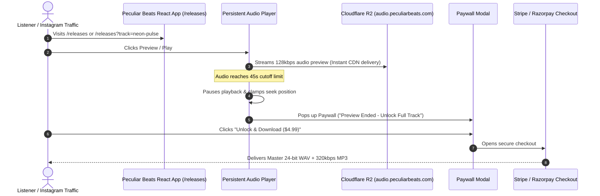

# Cloudflare R2 Audio Storage Architecture & Gating Plan

This document outlines the architecture, setup instructions, security, and implementation for storing and streaming music using **Cloudflare R2 Storage (Free Tier)** with zero bandwidth/egress fees and global CDN edge caching.

---

## 1. Why Cloudflare R2 is the Best Choice for Audio

### Cloudflare R2 Free Tier Quotas
| Metric | Cloudflare R2 Free Allowance | Comparison vs Firebase Spark |
| :--- | :--- | :--- |
| **Storage Capacity** | **10 GB / month (Free)** | 2x larger than Firebase (5 GB) |
| **Download Egress / Bandwidth** | **$0.00 (100% FREE & UNLIMITED)** | Firebase charges/limits to 1 GB/day |
| **Class B Operations (Reads/Streams)** | **10,000,000 requests / month (Free)** | Easily handles 50,000+ monthly listeners |
| **Class A Operations (Uploads/Writes)** | **1,000,000 requests / month (Free)** | Massive quota for track additions |
| **CDN Edge Caching** | **Global Cloudflare Anycast CDN** | Ultra-low latency worldwide playback |
| **Frontend Bundle Size** | **0 KB added (Native HTTP URLs)** | No heavy Firebase SDK required |

> [!NOTE]
> **Zero Egress Advantage**: Cloudflare R2 never charges for data transfer out. Whether 100 or 10,000 users stream your audio previews simultaneously, your bandwidth cost remains **$0.00**.

---

## 2. Storage Bucket Architecture & Folder Structure

```
Cloudflare R2 Bucket: `peculiar-beats-audio`
│
├── previews/                        # Publicly accessible via R2 Public URL / Custom Domain
│   ├── neon-pulse-preview.mp3       # 45-60s clip (128kbps, ~1MB)
│   ├── delhi-after-dark-preview.mp3
│   ├── cyber-odyssey-preview.mp3
│   └── sub-zero-bass-preview.mp3
│
├── artwork/                         # High-res square artwork (WebP/JPG, ~100KB)
│   ├── neon-pulse.webp
│   ├── delhi-after-dark.webp
│   └── cyber-odyssey.webp
│
└── masters/                         # Private: Restricted or delivered via signed link / Google Drive after payment
    ├── neon-pulse/
    │   ├── neon-pulse-master-24bit.wav
    │   └── neon-pulse-320kbps.mp3
    └── delhi-after-dark/
        ├── delhi-after-dark-master-24bit.wav
        └── delhi-after-dark-320kbps.mp3
```

---

## 3. Public Access & Custom Domain Setup

Cloudflare R2 offers two ways to expose audio previews and artwork to the web:

1. **R2 dev. subdomain (Instant & Free)**:
   `https://pub-<unique-hash>.r2.dev/previews/neon-pulse-preview.mp3`
2. **Custom Subdomain (Recommended for branding & CDN caching)**:
   Connect a subdomain on your domain (e.g., `https://audio.peculiarbeats.com` or `https://cdn.peculiarbeats.com`):
   `https://audio.peculiarbeats.com/previews/neon-pulse-preview.mp3`

---

## 4. End-to-End System Architecture



---

## 5. Frontend Integration (Zero SDK Overhead)

Because Cloudflare R2 serves files over standard HTTPS via global CDN, **no external SDK or client library is needed**.

### In `src/constants/musicTracks.js`:
```javascript
const R2_BASE_URL = "https://pub-xxxxxxxxxxxx.r2.dev"; 
// OR custom domain: "https://audio.peculiarbeats.com"

export const musicTracks = [
  {
    id: "neon-pulse",
    title: "Neon Pulse",
    subtitle: "Festival Peak Time Mix",
    artist: "Peculiar Beats",
    genre: "Peak Time Techno",
    bpm: 130,
    key: "Fm",
    duration: "4:12",
    durationSec: 252,
    price: "$4.99",
    priceInr: "₹399",
    coverArt: `${R2_BASE_URL}/artwork/neon-pulse.webp`,
    previewUrl: `${R2_BASE_URL}/previews/neon-pulse-preview.mp3`,
    paymentUrl: "https://buy.stripe.com/your_link_here",
    downloadUrl: "#",
    tags: ["Festival Ready", "Heavy Bass", "24-bit WAV Included"],
    description: "Driving underground techno with hypnotic modular synth leads.",
    isExclusive: true,
    isPopular: true,
  },
];
```

---

## 6. Audio Preview Gating (45s Limit)

In `src/context/AudioPlayerContext.jsx`:
- Playback runs up to `PREVIEW_LIMIT_SECONDS = 45`.
- Scrubber is clamped so seeking past 45s is restricted prior to purchase.
- Reaching the limit automatically pauses audio and triggers `PurchaseModal.jsx`.
