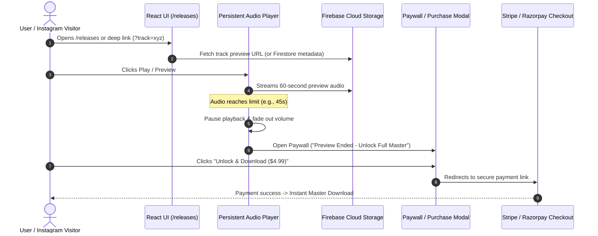

# Firebase Cloud Storage (Spark Plan) Music Architecture & Audio Gating Plan

This document outlines the architecture, setup instructions, security rules, and code implementation to store music in **Firebase Cloud Storage (Spark Plan / Free Tier)**, dynamically stream previews in the UI, and automatically gate playback after a time limit (e.g., 45-60 seconds) with a payment paywall.

---

## 1. Overview & Spark Plan (Free Tier) Feasibility

### Firebase Spark Plan Quotas
| Resource | Spark Plan Free Quota | Monthly Feasibility for ~3,000 Users |
| :--- | :--- | :--- |
| **Storage Capacity** | **5 GB** | ~100+ master tracks & 500+ preview files |
| **Download Bandwidth** | **1 GB / day (~30 GB / month)** | ~15,000 preview streams (at ~2MB per 60s 128kbps MP3) |
| **Upload Operations** | **20,000 / day** | More than sufficient for admin uploads |
| **Download Operations** | **50,000 / day** | Easily handles 3,000+ active listeners |

> [!TIP]
> **Bandwidth Optimization Strategy**:
> - Store compressed **60-second MP3 previews (128kbps, ~1MB each)** in a public `/previews/` storage bucket folder.
> - Store full **Lossless 24-bit WAV & 320kbps Master files (~40-80MB)** in a locked `/masters/` folder.
> - This keeps your daily download bandwidth well below the 1 GB/day Spark free limit while delivering instant audio streaming.

---

## 2. Storage Bucket Folder Structure

```
gs://<your-firebase-project>.appspot.com/
├── previews/                        # Publicly readable by web app
│   ├── neon-pulse-preview.mp3       # 45-60s clip (128kbps, ~1MB)
│   ├── delhi-after-dark-preview.mp3
│   └── cyber-odyssey-preview.mp3
├── artwork/                         # Track cover art images (WebP/JPG)
│   ├── neon-pulse.webp
│   └── delhi-after-dark.webp
└── masters/                         # PROTECTED: Restricted from public read
    ├── neon-pulse/
    │   ├── neon-pulse-master-24bit.wav
    │   └── neon-pulse-320kbps.mp3
    └── delhi-after-dark/
        └── delhi-after-dark-master.wav
```

---

## 3. Firebase Storage Security Rules

In the Firebase Console -> **Storage** -> **Rules**, configure:

```javascript
rules_version = '2';
service firebase.storage {
  match /b/{bucket}/o {
    
    // 1. Preview clips and artwork are publicly readable for streaming in UI
    match /previews/{fileName} {
      allow read: if true;
      allow write: if request.auth != null && request.auth.token.admin == true;
    }
    
    match /artwork/{fileName} {
      allow read: if true;
      allow write: if request.auth != null && request.auth.token.admin == true;
    }
    
    // 2. Full masters are locked: Only accessible via admin / signed payment tokens
    match /masters/{allPaths=**} {
      allow read: if request.auth != null;
      allow write: if request.auth != null && request.auth.token.admin == true;
    }
  }
}
```

---

## 4. Architecture & Data Flow



---

## 5. Frontend Implementation Guide

### Step 1: Install Firebase SDK
```bash
npm install firebase
```

### Step 2: Initialize Firebase Client (`src/services/firebase.js`)
```javascript
import { initializeApp } from "firebase/app";
import { getStorage, ref, getDownloadURL } from "firebase/storage";

const firebaseConfig = {
  apiKey: import.meta.env.VITE_FIREBASE_API_KEY,
  authDomain: import.meta.env.VITE_FIREBASE_AUTH_DOMAIN,
  projectId: import.meta.env.VITE_FIREBASE_PROJECT_ID,
  storageBucket: import.meta.env.VITE_FIREBASE_STORAGE_BUCKET,
  messagingSenderId: import.meta.env.VITE_FIREBASE_MESSAGING_SENDER_ID,
  appId: import.meta.env.VITE_FIREBASE_APP_ID,
};

const app = initializeApp(firebaseConfig);
export const storage = getStorage(app);

// Helper to get public preview URL
export async function getTrackPreviewUrl(trackSlug) {
  try {
    const previewRef = ref(storage, `previews/${trackSlug}-preview.mp3`);
    return await getDownloadURL(previewRef);
  } catch (error) {
    console.error("Error fetching preview from Firebase Storage:", error);
    return null;
  }
}
```

---

### Step 3: Implement Audio Gating in `AudioPlayerContext.jsx`

Add preview time limit threshold (e.g., 45 seconds) and trigger the paywall modal:

```javascript
// Constant: Maximum free preview playback in seconds
const PREVIEW_LIMIT_SECONDS = 45;

// Inside audio timeupdate listener:
const handleTimeUpdate = () => {
  const current = audio.currentTime;
  setCurrentTime(current);

  // Gating check: if preview reaches limit, pause and open purchase modal
  if (current >= PREVIEW_LIMIT_SECONDS && !hasUnlockedFullTrack) {
    audio.pause();
    setIsPlaying(false);
    
    // Trigger purchase paywall
    setPreviewLimitReached(true);
    openPurchaseModal(currentTrack);
  }
};
```

---

### Step 4: Preview Limit Banner in UI (`PersistentAudioPlayer.jsx` & `PurchaseModal.jsx`)

When `previewLimitReached === true`:
1. The player progress bar shows a lock icon at the 45s mark.
2. An ambient toast notification informs the listener:
   `"🎧 Preview limit reached. Unlock the full 24-bit Master WAV to continue listening & download."`
3. The **Purchase Modal** automatically opens with pre-selected track details.

---

## 6. Phase 1 vs Phase 2 Delivery Strategy

### Phase 1 (100% Free & No Server Overhead)
- **Uploads**: Upload 45-60s preview clips and artwork via Firebase Web Console.
- **Track Catalog**: Reference Firebase Storage preview URLs inside `src/constants/musicTracks.js`.
- **Gating**: Client-side preview limit (45s) pauses audio and opens `PurchaseModal.jsx`.
- **Payment Link**: Stripe Payment Link or Razorpay Payment Page URL. Post-payment redirect sends user directly to master download file or Google Drive / Firebase signed link.

### Phase 2 (Automated Webhooks & Token Gating)
- **Firestore DB**: Store dynamic track records and prices.
- **Cloud Functions / Netlify Functions**: Listen to Stripe webhooks upon successful checkout, generate single-use signed Firebase Storage download URLs valid for 24 hours.

---

## 7. Implementation Checklist

- [ ] Create Firebase Project and activate **Storage** in Firebase Console.
- [ ] Configure Storage security rules for `/previews/` and `/artwork/`.
- [ ] Upload audio previews and cover arts to Firebase Storage bucket.
- [ ] Add Firebase config `.env` variables (`VITE_FIREBASE_STORAGE_BUCKET`, etc.).
- [ ] Connect `getDownloadURL()` in track catalog or audio context.
- [ ] Set `PREVIEW_LIMIT_SECONDS = 45` in `AudioPlayerContext.jsx`.
- [ ] Test preview cutoff and automated paywall modal presentation.
