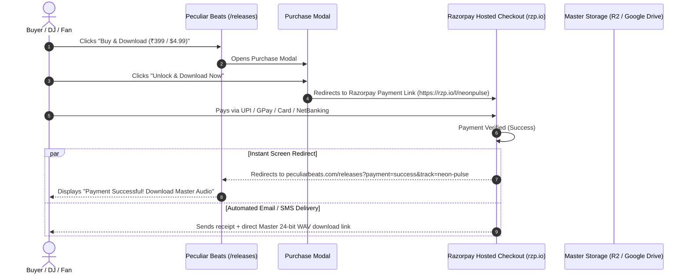

# Razorpay Payment Links Setup & Delivery Plan (Peculiar Beats)

This document provides a step-by-step guide to set up **Razorpay Payment Links & Payment Pages** for selling music tracks on [peculiarbeats.com](https://peculiarbeats.com/releases) with **zero backend server maintenance** and **instant automated download delivery**.

---

## 1. Why Razorpay for Peculiar Beats

| Feature | Razorpay Benefit |
| :--- | :--- |
| **Zero Fixed Costs** | Pay only standard ~2% per successful sale (no monthly setup fees) |
| **All Indian Payment Modes** | UPI (Google Pay, PhonePe, Paytm, BHIM), QR scan, Cards, NetBanking, Wallets |
| **International Payments** | Accepts international Visa, Mastercard, Amex in USD, EUR, GBP, AED, etc. |
| **No Backend Required (Phase 1)** | Razorpay hosts the secure checkout page (`rzp.io/l/...`) |
| **Automated Delivery** | Delivers the Master Audio download link on the screen and via automated Email/SMS |

---

## 2. End-to-End Payment & Download Flow



---

## 3. Step-by-Step Setup Guide

### Step 1: Create & Activate Razorpay Account
1. Go to [razorpay.com](https://razorpay.com/) and sign up.
2. Complete KYC verification (Business Type: *Individual*, *Freelancer*, or *Sole Proprietorship*).
3. Under **Settings ➔ Configuration**:
   - Upload your logo (**Peculiar Beats** logo).
   - Set brand color to **Electric Purple** (`#BF00FF`).
   - (Optional) Enable **International Payments** under *Payment Methods* if selling worldwide.

---

### Step 2: Create a Payment Link for Each Track
1. In the Razorpay Dashboard, go to **Payment Links** (or **Payment Pages**) ➔ Click **Create Payment Link**.
2. **Details**:
   - **Title / Purpose**: `Peculiar Beats - Neon Pulse (24-bit Master WAV + MP3)`
   - **Amount**: `399` INR (or custom price)
   - **Reference ID (optional)**: `neon-pulse`
3. **Customer Details**:
   - Check **Customer Email** (required for automated delivery)
   - Check **Customer Phone** (for instant WhatsApp/SMS notification)
4. **After-Payment Configuration**:
   - In *Settings* ➔ **Redirect URL**, enter:
     ```
     https://peculiarbeats.com/releases?payment=success&track=neon-pulse
     ```
   - Check **Redirect after payment** (Automatically sends the customer back to your website within 3 seconds).
5. Click **Create Payment Link** ➔ Copy the generated short link (e.g., `https://rzp.io/l/neonpulse`).

---

### Step 3: Attach the Master Download Link to the Receipt
In Razorpay, you can automatically provide the download link to buyers:
1. In the Payment Link creation window ➔ **Notes / Description**:
   Add:
   ```
   Thank you for purchasing Neon Pulse by Peculiar Beats!
   Your 24-bit Lossless WAV + 320kbps MP3 Master package is available here:
   https://pub-your-bucket.r2.dev/masters/neon-pulse/neon-pulse-master.zip
   ```
2. Razorpay automatically includes this message in the on-screen receipt and the buyer's email invoice.

---

### Step 4: Link Payment URLs in `src/constants/musicTracks.js`

Update the `paymentUrl` property for each track in [src/constants/musicTracks.js](file:///home/shubham/Desktop/Project/peculiar-site-2.0/src/constants/musicTracks.js):

```javascript
export const musicTracks = [
  {
    id: "neon-pulse",
    title: "Neon Pulse",
    subtitle: "Festival Peak Time Mix",
    artist: "Peculiar Beats",
    genre: "Peak Time Techno",
    bpm: 130,
    key: "Fm",
    price: "$4.99",
    priceInr: "₹399",
    previewUrl: "https://pub-xxxxxx.r2.dev/previews/neon-pulse-preview.mp3",
    coverArt: "https://pub-xxxxxx.r2.dev/artwork/neon-pulse.webp",
    paymentUrl: "https://rzp.io/l/neonpulse", // 👈 Your live Razorpay Payment Link
    tags: ["Festival Ready", "Heavy Bass", "24-bit WAV Included"],
  },
  {
    id: "delhi-after-dark",
    title: "Delhi After Dark",
    subtitle: "Club Edit & Extended Intro",
    artist: "Peculiar Beats",
    genre: "Afro & Tech House",
    bpm: 126,
    key: "Am",
    price: "$4.99",
    priceInr: "₹399",
    previewUrl: "https://pub-xxxxxx.r2.dev/previews/delhi-after-dark-preview.mp3",
    coverArt: "https://pub-xxxxxx.r2.dev/artwork/delhi-after-dark.webp",
    paymentUrl: "https://rzp.io/l/delhiafterdark", // 👈 Your live Razorpay Payment Link
    tags: ["Afro Tech", "Groovy Percussion", "Club Favorite"],
  },
  // Repeat for remaining tracks...
];
```

---

## 4. Post-Payment Download Screen Handling (UI Feature)

When the user is redirected back to `https://peculiarbeats.com/releases?payment=success&track=neon-pulse`:
1. The web app reads the `?payment=success` URL parameter.
2. A celebration banner or download card pops up:
   - *"🎉 Payment Successful! Your Master Download for Neon Pulse is ready."*
   - Direct button: **"Download Lossless Master WAV (ZIP)"**.

---

## 5. Summary Checklist

- [ ] Sign up & complete KYC on [razorpay.com](https://razorpay.com/).
- [ ] Upload brand logo and set theme color to Electric Purple (`#BF00FF`).
- [ ] Create Razorpay Payment Link for each music track (`rzp.io/l/...`).
- [ ] Set post-payment redirect URL to `https://peculiarbeats.com/releases?payment=success&track=<track-id>`.
- [ ] Paste Razorpay links into `src/constants/musicTracks.js`.
- [ ] Test a live test transaction with UPI / Test Card.
- [ ] Verify instant redirect and receipt delivery.
